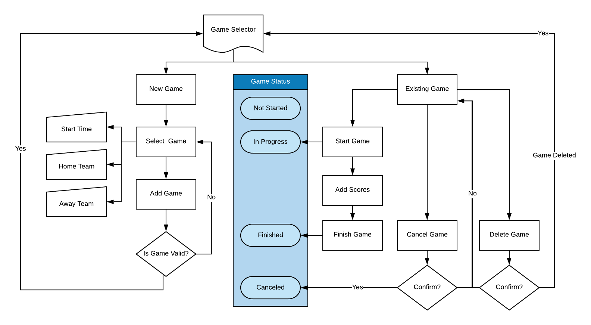
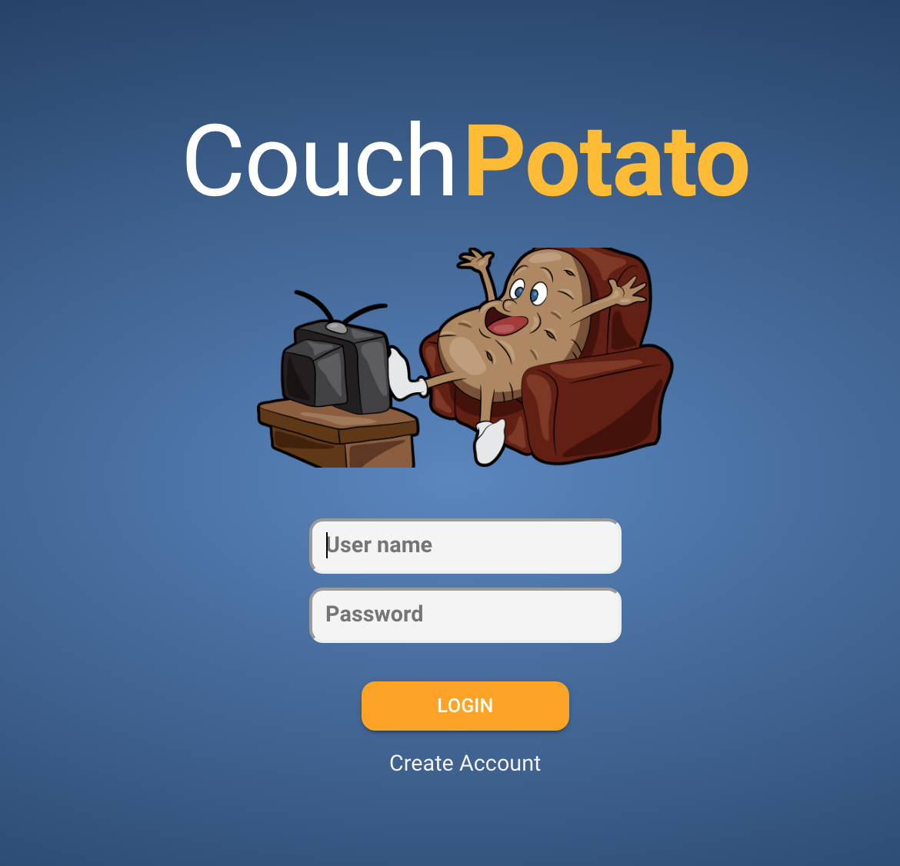

# Functional Requirements

## Background

BookiePro requires real-time data feeds in order to create all the various sports, events, markets etc. that are the basis of the sporting exchange. An going challenge has been getting enough of these data feeds that are accurate and reliable.

Many operations required for Bookie, such as creating a new game, require more than one approval which means that at least two data feeds send the exact same information. This is a real problem when there might only be two or three data feeds available at any given time.

Each data feed is consumed by data proxy software, operated by independent organizations, before parsing and normalizing the data and sending it through to BOS for validation, and then finally on to the blockchain.

In it's simplest form the sports data flows from data feed provider -&gt; data proxy - &gt; BOS - &gt; blockchain -&gt; BookiePro. This process is automated, which is desirable, but this brings it's own problems because there isn't enough manual validation on the data until after it fails. The automated process has little ability to correct data that is either sent from the feed provider or incorrectly normalized by the data proxy.

The concept of Couch Potato came about from looking at the process backwards. We know data comes from a feed provider, as what we see as the original source of truth. But if you go back from there who knows how many other layers there are. Does the feed provider get their data directly? Maybe they use a third party to scrape the data and then they purchase it. Maybe the data scraper uses a third party ... and so on. Ultimately though there has to be somebody watching games and inputting the data.

This is the Couch Potato concept. Why not just have a person inputting data directly into a portal or API that then gets posted directly to BOS. In this model the person is the 'data feed provider' and the API or portal the 'data proxy'

## Objective

Couch Potato aims to improve the data feed and data proxy challenges facing BookiePro by:

* Creating a simple to use web portal that uses only data taken directly from Bookiesports and therefore guaranteed correct.
* Pushing data directly to BOS as it's entered, no latency or 'spooling' of data.
* Incorporating an extensive, powerful, API that can perform all the functions or the web application completely independently, or can be combined with the web application as well.
* Create an 'infinitely scalable' system that can be spun up on as many servers as data proxies are required. Every instance of Couch Potato is it's own data proxy.
* Allowing third parties to take the API and integrate into their own data gathering processes, whether manual or automated.
* Becoming a 'pay-per-input' service for the users of Couch Potato that are entering the data. Couch Potato will track every input such that a suitable payment model can be created for reimbursing the users.
* Keeping the data feed providers accountable. If any instance of Couch Potato, operating as a mainnet data proxy, consistently delivers bad data or is unreliable, then that data proxy won't qualify for payment, and ultimately will be removed by witness consensus.

## High Level Flow Diagrams

### Login and Navigation

### Game Selector

### Data Replay

## Requirements

### 1. Home Page

The home page will be the first page to load and from where the user will be able to login or create an account.

**Inputs**

| Caption | Max Length | Placeholder Text |
| :--- | :--- | :--- |
| User Name | 24 | User name |
| Password | 40 | Password |

**Actions**

| Caption | Type | Action |
| :--- | :--- | :--- |
| LOGIN | Button | Validate user name and password and then open the Dashboard |
| Create Account | Text | Open the create account screen |

**Validation**

| **Exception** | Error Message | Screen |
| :--- | :--- | :--- |
| No user name | Username not entered |  |
| No password | Password not entered |  |
| Password or user name is invalid | Invalid username or password |  |

### 2. Create Account

### 3. Dashboard

#### 3.1 Sports Tabs

#### 3.2 Leagues Tabs

#### 3.3 Calendar

#### **3.4 Log Out**

#### **3.5 Preferences**

### 4. Game Selector

#### 4.1 Add New Game

#### 4.2 Change Game Status

#### 4.3 Edit Game

**4.3.1 Delete Game**

**4.3.2 Cancel Game**

### **5. Run Replay**

### **6. Notifications**

\*\*\*\*

\*\*\*\*

