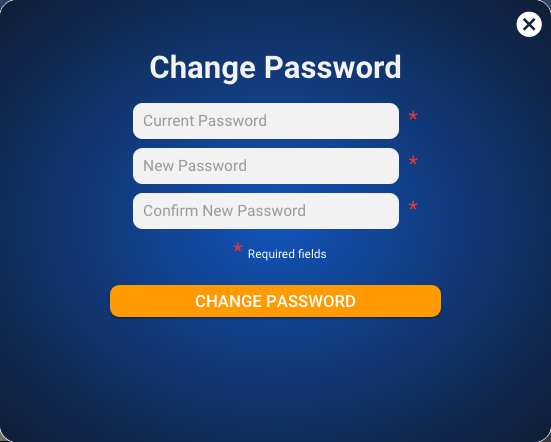

# Change Password

The Change Password screen is opened by clicking on the `Change Password` menu item in the the [account menu.](dashboard/account-menu.md)

**Captions**

| Text | Type | Comments |
| :--- | :--- | :--- |
| Change Password | Static |   |
| Required fields\* | Static |   |

**Inputs**

<table>
  <thead>
    <tr>
      <th style="text-align:left">Name</th>
      <th style="text-align:left">Constraints</th>
      <th style="text-align:left">Placeholder Text</th>
    </tr>
  </thead>
  <tbody>
    <tr>
      <td style="text-align:left">Current Password</td>
      <td style="text-align:left">
        
Max Length: 40

        
Min Length: 8

      </td>
      <td style="text-align:left">Current Password</td>
    </tr>
    <tr>
      <td style="text-align:left">New Password</td>
      <td style="text-align:left">
        
Max Length: 40

        
Min Length: 8

      </td>
      <td style="text-align:left">New Password</td>
    </tr>
    <tr>
      <td style="text-align:left">Confirm Password</td>
      <td style="text-align:left">
        
Max Length: 40

        
Min Length: 8

      </td>
      <td style="text-align:left">Confirm Password</td>
    </tr>
  </tbody>
</table>**Actions**

| Caption | Type | Action |
| :--- | :--- | :--- |
| CHANGE PASSWORD | Button | Validate all fields then update the password and return to the [Dashboard](dashboard/) |
| X | Image | Close the screen without adding a new account and return to the [Dashboard](dashboard/) |

**Validation**

| **Exception** | Error Message |
| :--- | :--- |
| No current password | Current password not entered |
| Current password is wrong | Current password is incorrect. |
| No new password | New password not entered |
| New password too short | New password must be at least 8 characters |
| No confirm new password | Confirm new password not entered. |
| Confirm new password too short | Confirm new password must be at least 8 characters |
| New and confirm new don't match | New password and confirm new password are different |

