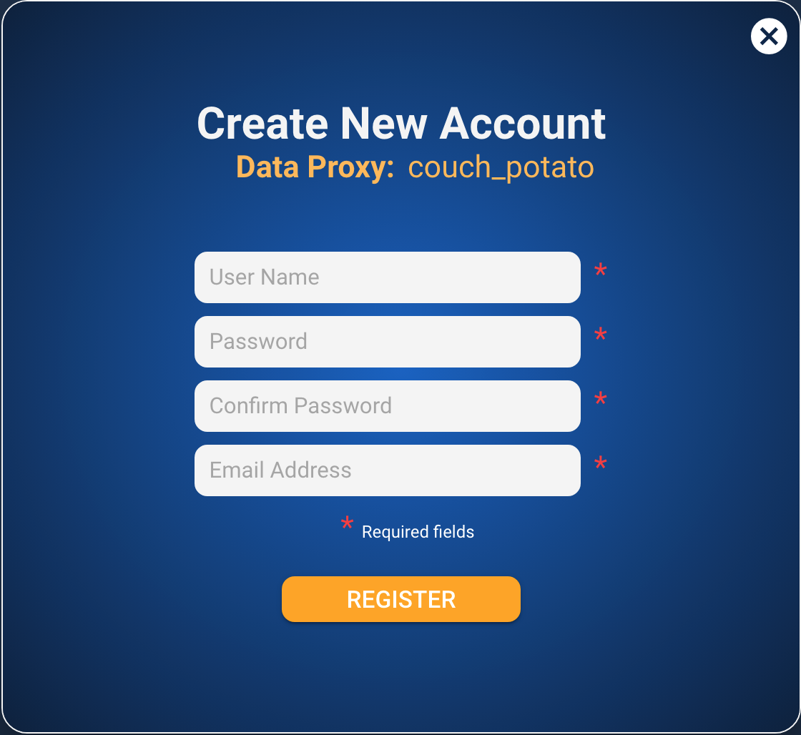

# Create Account

The create account screen is opened from the Home Page and is the screen where every new account is created/registered.

**Captions**

| Text | Type | Comments |
| :--- | :--- | :--- |
| Create New Account | Static |   |
| Data Proxy | Static |   |
| \[proxy name\] | Dynamic | Value set in the config-dataproxy.json |
| \*Required fields | Static |   |

**Inputs**

| Name | Max Length | Min Length | Placeholder Text |
| :--- | :--- | :--- | :--- |
| User Name | 24 | 8 | User name |
| Password | 40 | 8 | Password |
| Confirm Password | 40 | 8 | Confirm Password |
| Email Address | 60 | n/a | Email Address |

**Actions**

| Caption | Type | Action |
| :--- | :--- | :--- |
| REGISTER | Button | Validate all fields and then return to the [Home Page](home-page.md) |
| X | Image | Close the screen without adding a new account and return to the [Home Page](home-page.md) |

**Validation**

| **Exception** | Error Message |
| :--- | :--- |
| No user name | Username not entered |
| No password | Password not entered |
| Password too short | Password must be at least 8 characters |
| No confirm password | Confirm password not entered |
| Password and confirm password not the same | Password and Confirm Password are different |
| No email | Email not entered |
| Invalid email, format must be xxx@xxx.xxx | Email is not valid |


**Note**: For the first release there will be no additional validation on the password format for strength or special characters etc. The only constraint is that the length must be &gt;=8 and &lt;= 40 characters.


