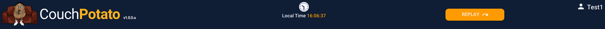
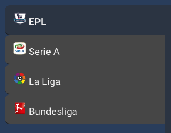
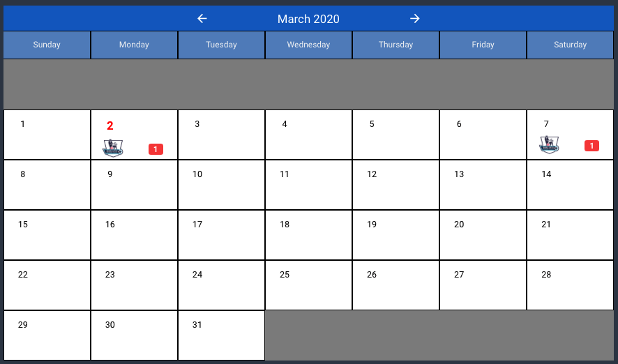

# Dashboard

The dashboard is the main screen and is opened from the [Home Page](home-page.md) as soon as the user is logged in.

The components of the dashboard are:

## Header

The dashboard header is shown at the top of the screen and is non-scrollable. That is to say that if the application is run on a small display such that the user has to scroll up and down to see all of the dashboard, the header is always 'pinned' at the top of the screen.

### **Captions**

| Text | Type | Comments |
| :--- | :--- | :--- |
| \[title\] | Dynamic | Default is CouchPotato but can be configured using the `title1` and `title2` properties in the `config.json` file.  |
| \[icon/Image\] | Dynamic |  The icon or image shown in the top left of the header. Configured using the `iconsmall` property in the `config.json` file. Default is `couch-potato.png` |
| \[version\] | Dynamic | The version number/value of the release. Configured using the version property in the `config.json` file.  |
| Local Time | Static |   |
| \[time\] | Dynamic | The current time in the format \[hh:mm:ss\]. Time changes every second. |
| \[username\] | Dynamic | The \(user\)name of the logged in user. |

### **Actions**

| Caption | Type | Action |
| :--- | :--- | :--- |
|  👤 | Icon | Open the [account menu](dashboard.md#account-menu). |
| Replay | Button | Open the Replay screen. |

### Assets

## Sports Tabs

The sports tab runs horizontally across the dashboard and displays one tab for each sport that is enabled. The tabs are dynamic and configured through the MySql database [`Sports`](../../database/objects/tables.md#sports) table. 

The order the sports tabs are displayed in is defined by their `id` value in the [`Sports`](../../database/objects/tables.md#sports)  table.

There is no limit on the number of sports tabs that can be created. If the tabs reach the horizontal limit of the application then they will stack in to multiple rows. Realistically there should never be so many sports enabled at any one time to cause the tabs to be stacked.


**Important**: The sports tabs must be 100% configurable through the database only. Sports must be added or removed without any code changes.


Clicking on any unselected tab will:

1. Update the Leagues Tabs to show only the leagues associated with the selected sport.
2. Change the calendar display to show only events for the selected sport and league.

By default, when a new sports tab is selected the league will default to the first one in the list.

### **Captions**

<table>
  <thead>
    <tr>
      <th style="text-align:left">Text</th>
      <th style="text-align:left">Type</th>
      <th style="text-align:left">Comments</th>
    </tr>
  </thead>
  <tbody>
    <tr>
      <td style="text-align:left">[sports name]</td>
      <td style="text-align:left">Dynamic</td>
      <td style="text-align:left">Value set in <a href="../../database/objects/tables.md#sports"><code>Sports</code></a> table</td>
    </tr>
    <tr>
      <td style="text-align:left">[icon]</td>
      <td style="text-align:left">Dynamic</td>
      <td style="text-align:left">
        
Path and name defined in the <code>icon</code> column of the <a href="../../database/objects/tables.md#sports"><code>Sports</code></a> table.

        
The icon itself must exist in the corresponding <code>asset/imgs</code> folder
          in the application

      </td>
    </tr>
  </tbody>
</table>
**Note**: There is no restriction on the icons/images to be used for each sport, but logically they should reflect the sport!


### **Actions**

| Caption | Type | Action |
| :--- | :--- | :--- |
| \[Sport\] | Text | Change calendar and leagues to selected sport. |

## Leagues Tab

The leagues tab runs vertically down the left side of the dashboard and displays one tab for each league that is configured for the selected sport. The tabs are dynamic and configured through the MySql database [`Leagues`](../../database/objects/tables.md#leagues) table. 

The order the leagues tabs are displayed in is defined by their `id` value in the [`Leagues`](../../database/objects/tables.md#leagues) table.

There is no limit on the number of sports tabs that can be created. If the tabs reach the vertical limit of the application then they will stack in to multiple columns. Realistically there should never be so many leagues enabled at any one time to cause the tabs to be stacked.


**Important**: The leagues tabs must be 100% configurable through the database only. Leagues must be added or removed without any code changes.


Clicking on any unselected tab will change the calendar display to show only events for the selected sport and league.

### **Captions**

<table>
  <thead>
    <tr>
      <th style="text-align:left">Text</th>
      <th style="text-align:left">Type</th>
      <th style="text-align:left">Comments</th>
    </tr>
  </thead>
  <tbody>
    <tr>
      <td style="text-align:left">[league name]</td>
      <td style="text-align:left">Dynamic</td>
      <td style="text-align:left">Value set in <a href="../../database/objects/tables.md#leagues"><code>Leagues</code></a> table.</td>
    </tr>
    <tr>
      <td style="text-align:left">[icon]</td>
      <td style="text-align:left">Dynamic</td>
      <td style="text-align:left">
        
Path and name defined in the <code>icon</code> column of the <a href="../../database/objects/tables.md#leagues"><code>Leagues</code></a> table.

        
The icon itself must exist in the corresponding <code>asset/imgs/leagues</code> folder
          in the application.

      </td>
    </tr>
  </tbody>
</table>### **Actions**

| Caption | Type | Action |
| :--- | :--- | :--- |
| \[Sport\] | Text | Change calendar to the selected league of the selected sport. |

## Calendar

The calendar component is the main 'engine' of the application. It's here that the user will navigate through, enter and select new games.

## Notifications

## Replay

## Account Menu

