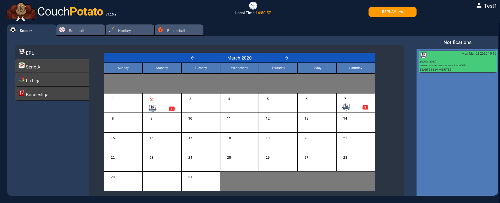

# Dashboard

The dashboard is the main screen and is opened from the [Home Page](home-page.md) once the user enters correct account credentials \(username and password\).

The components of the dashboard are:

## Sports Tabs

The sports tab runs vertically across the dashboard and displays one tab for each sport that is enabled. The tabs are dynamic and configured through the MySql database [`Sports`](../../database/objects/tables.md#sports) table. 

The order the sports tabs are displayed in is defined by their `id` value in the [`Sports`](../../database/objects/tables.md#sports)  table.

There is no limit on the number of sports tabs that can be created. If the tabs reach the limit of the application horizontally then they will stack in to multiple rows.


**Important**: The sports tabs must be 100% configurable through the database only. Sports must be added or removed without any code changes.


Clicking on any unselected tab will:

1. Update the Leagues Tabs to show only the leagues associated with the selected sport.
2. Change the calendar display to show only events for the selected sport and league.

By default, when a new sports tab is selected the league will default to the first one in the list.

**Captions**

<table>
  <thead>
    <tr>
      <th style="text-align:left">Text</th>
      <th style="text-align:left">Type</th>
      <th style="text-align:left">Comments</th>
    </tr>
  </thead>
  <tbody>
    <tr>
      <td style="text-align:left">[sports name]</td>
      <td style="text-align:left">Dynamic</td>
      <td style="text-align:left">Value set in <a href="../../database/objects/tables.md#sports"><code>Sports</code></a> table</td>
    </tr>
    <tr>
      <td style="text-align:left">[icon]</td>
      <td style="text-align:left">Dynamic</td>
      <td style="text-align:left">
        
Path and name defined in the <code>icon</code> column of the <a href="../../database/objects/tables.md#sports"><code>Sports</code></a> table.

        
The icon itself must exist in the corresponding asset/imgs folder in the
          application

      </td>
    </tr>
  </tbody>
</table>## Leagues Tabs

## Calendar

## Notifications

## Replay

## Account Menu

