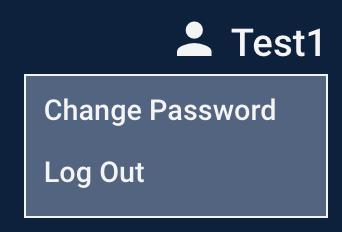

# Account Menu

The account menu is accessed by clicking on the user icon at the far left of the header.

The account menu has two features.

### Change Password

Click on the Change Password menu item to open the [Change Password](../change-password.md) screen

### Log Out

Click on the Log Out menu item to log out of the application and return to the [Home Page.](../home-page.md)


**Note**: The Account Menu will automatically close after 10 seconds if it isn't used.


