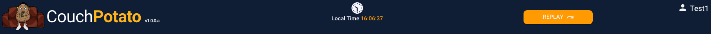

# Header

The dashboard header is shown at the top of the screen and is non-scrollable. That is to say that if the application is run on a small display such that the user has to scroll up and down to see all of the dashboard, the header is always 'pinned' at the top of the screen.

### **Captions**

| Text | Type | Comments |
| :--- | :--- | :--- |
| \[title\] | Dynamic | Default is CouchPotato but can be configured using the `title1` and `title2` properties in the `config.json` file.  |
| \[icon/Image\] | Dynamic |  The icon or image shown in the top left of the header. Configured using the `iconsmall` property in the `config.json` file. Default is `couch-potato.png` |
| \[version\] | Dynamic | The version number/value of the release. Configured using the version property in the `config.json` file.  |
| Local Time | Static |   |
| \[time\] | Dynamic | The current time in the format \[hh:mm:ss\]. Time changes every second. |
| \[username\] | Dynamic | The \(user\)name of the logged in user. |

### **Actions**

| Caption | Type | Action |
| :--- | :--- | :--- |
|  👤 | Icon | Open the [account menu](./#account-menu). |
| Replay | Button | Open the Replay screen. |

### Assets

## 

