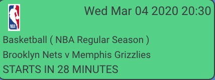

# Notifications

The notifications panel is displayed on the right side of the dashboard and is where all notifications \(reminders\) will be posted for all games about to start or finish.

The notifications will be refreshed at a configurable millisecond interval set in `config-dataproxy.json`. The default will be 3,000 \(3 seconds\).

Each notification will take the form of a 'note' which will have the following information:

#### Colour

