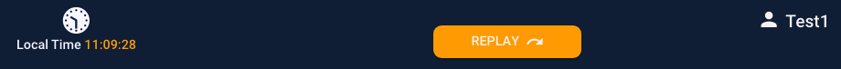
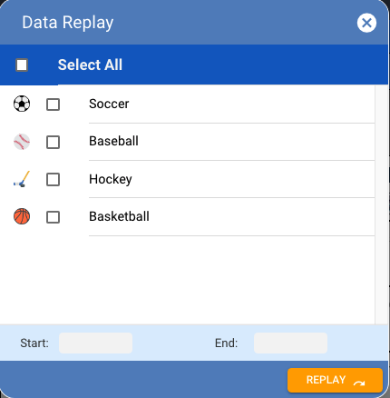

# Replay

The replay screen is displayed by clicking on the `REPLAY` button on the Dashboard header.

The purpose of the Replay feature is to give the user a manual way to send, or re-send, game create incidents to all of the BOS endpoints if for any reason they weren't correctly sent before.

Normally this feature shouldn't need to be used very often as a create incident is automatically sent every time a game is created. But there could be occasions when the application correctly records a game as being created but the information is recording by the BOS nodes. If that happened then running a Replay will 'flush' all the games between the start and end dates and send create incidents to the BOS nodes a second time.


**Important**: The Replay feature can only be used for games that are not yet started. Once a game is started a new create incident would be ignored.


Sports and leagues can be selected individually using check-boxes, or all sports and leagues can be selected or de-selected.

The range of data to be replayed will be set from the Start and End fields.

**Captions**

| Text/Image | Type | Comments |
| :--- | :--- | :--- |
| Data Replay | Static |   |
| Select All | Static |   |
| \[sport\] | Dynamic | All sport name in the [`sport`](../../../database/objects/tables.md#sports) table |
| \[league\] | Dynamic |  All league names associated with the selected sport taken from the [`leagues`](../../../database/objects/tables.md#leagues) table |
| \[sport icon\] | Dynamic | Applicable sport icon in the [`sport`](../../../database/objects/tables.md#sports) table |
| \[league icon\] | Dynamic | Applicable league icon in the [`leagues`](../../../database/objects/tables.md#leagues) table |
| Start: | Static |  |
| End: | Static |  |

**Inputs**

| Name | Type | Constraints |
| :--- | :--- | :--- |
| Select All | Checkbox |   |
| \[sport\] | Checkbox |   |
| \[league\] | Checkbox |   |
| Start | List | Valid date from list |
| End | List | Valid date from list |

**Actions**

| Caption | Type | Action |
| :--- | :--- | :--- |
| REGISTER | Button | Validate all fields and then return to the [Home Page](../home-page.md) |
| X | Image | Close the screen without adding a new account and return to the [Home Page](../home-page.md) |

**Validation**

| **Exception** | Error Message |
| :--- | :--- |
| No user name | Username not entered |
| No password | Password not entered |
| Password too short | Password must be at least 8 characters |
| No confirm password | Confirm password not entered |
| Password and confirm password not the same | Password and Confirm Password are different |
| No email | Email not entered |
| Invalid email, format must be xxx@xxx.xxx | Email is not valid |

