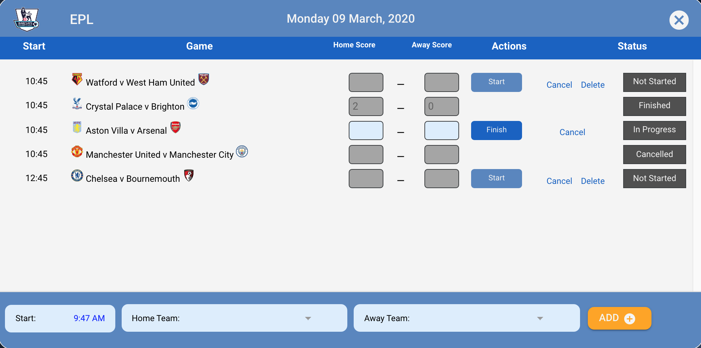

# Game Selector

The Game Selector is opened by clicking on the day cell of any calendar. The Game Selector is the engine behind all of the game incidents that are created and the posted to BOS.

The Game Selector is both used for creating new games/matches and then moving each game through the following standard incident workflow of create -&gt; in\_progress -&gt; result -&gt; finished.

The selector can also be used to Cancel or Delete games.

## Add Game

To add new game use the input fields at the bottom of the screen and then click on the `ADD` button.

**Captions**

| Text/Image | Type | Comments |
| :--- | :--- | :--- |
| Start | Static |   |
| Home Team | Static |   |
| Away Team | Static |  |

**Inputs**

| Name | Type | Constraints |
| :--- | :--- | :--- |
| Start | Date Selector |  Any valid date |
| Home Team | Drop Down selector | Drop down list of all teams associated with the selected sport and league. |
| Away Team | Drop Down selector | Drop down list of all teams associated with the selected sport and league. |

**Actions**

| Caption | Type | Action |
| :--- | :--- | :--- |
| ADD +  | Button | Add the game to the list of created games. |

**Validation**

| **Exception** | Error Message |
| :--- | :--- |
| No start time | Start time not entered |
| Home Team | No home team selected |
| Away Team | No away team selected |
| Home Team and Away Team must be different | Teams must be different |


**Note**: There is no validation to stop the same game from being created twice. The reason for this is because it's common in certain sports to have 'double-headers' where two teams play each other more than once in a day.



**Note**: There is no validation to stop a game start time from being in the passed. This is because game start times do change and it maybe necessary to start a game in the selector that has already started in real time.


Each new game will have its status set to `Not Started`

A [`create`](../../api/bos-schema.md#create) incident will be pushed to the BOS instances.

## Start Game

To start a game click on the `Start` button next to the game. The game status will then change to `In Progress`

**Actions**

| Caption | Type | Action |
| :--- | :--- | :--- |
| `Start`  | Button | Start the selected game. |

An [`in_progress`](../../api/bos-schema.md#in_progress) incident will be pushed to the BOS instances with the `whistle_start_time` set to the time when the `Start` button was clicked.

## Finish Game

To finish a game enter the score for both home and away teams and click on the `Finish` button next to the game. The game status will then change to `Finished`

**Inputs**

<table>
  <thead>
    <tr>
      <th style="text-align:left">Name</th>
      <th style="text-align:left">Type</th>
      <th style="text-align:left">Constraints</th>
    </tr>
  </thead>
  <tbody>
    <tr>
      <td style="text-align:left">Home Score</td>
      <td style="text-align:left">Text Box</td>
      <td style="text-align:left">Numeric, max 999</td>
    </tr>
    <tr>
      <td style="text-align:left">
        
Away

        
Score

      </td>
      <td style="text-align:left">Text Box</td>
      <td style="text-align:left">Numeric, max 999</td>
    </tr>
  </tbody>
</table>**Actions**

| Caption | Type | Action |
| :--- | :--- | :--- |
| `Finish`  | Button | Finish the selected game and record the score. |

A [`result`](../../api/bos-schema.md#result) incident followed by a [`finish`](../../api/bos-schema.md#finish) incident will be pushed to the BOS instances with the `whistle_end_time` set to the time when the Finish button was clicked, and the result to the home score and away score values.


Note: It's not possible to corrects scores and re-send them to BOS. For this reason the `finish` incident is sent immediately after the `result` incident as a result of just clicking on the `Finish` button.


## Cancel Game

Any game can be cancelled as long as it's either `Not Started` or `In Progress.`

To cancel a game click on the `Cancel` text next to the game. The game status will then change to `Canceled`

A `canceled` incident will be sent to BOS.


**Tip**: for the purposes of BOS incidents 'canceled' can also be interpreted as postponed but not as delayed. A delayed game is expected to restart. But once a game has been canceled it can't be restarted. If a game is canceled and then played the following day it would have to re-created with the new start time.


## Delete Game

A game can only be deleted if it hasn't been started \(has a status of `Not Started`\).

To delete a game click on the Delete text next to the game. The game status will then change to Deleted

A `canceled` incident will be sent to BOS so that BOS can tag the game int he same way as a canceled game.


**Note**: The difference between a canceled game and a deleted game is that a deleted game is basically a game that was entered in error and once deleted is removed from the database so it can be re-entered correctly if needed. A canceled game is a proper game that for one reason or other doesn't take place after being created correctly.


## Selector Grid

The selector grid is where all games are recorded as they get entered and moved through the workflow.

The selector grid is made up as follows:

