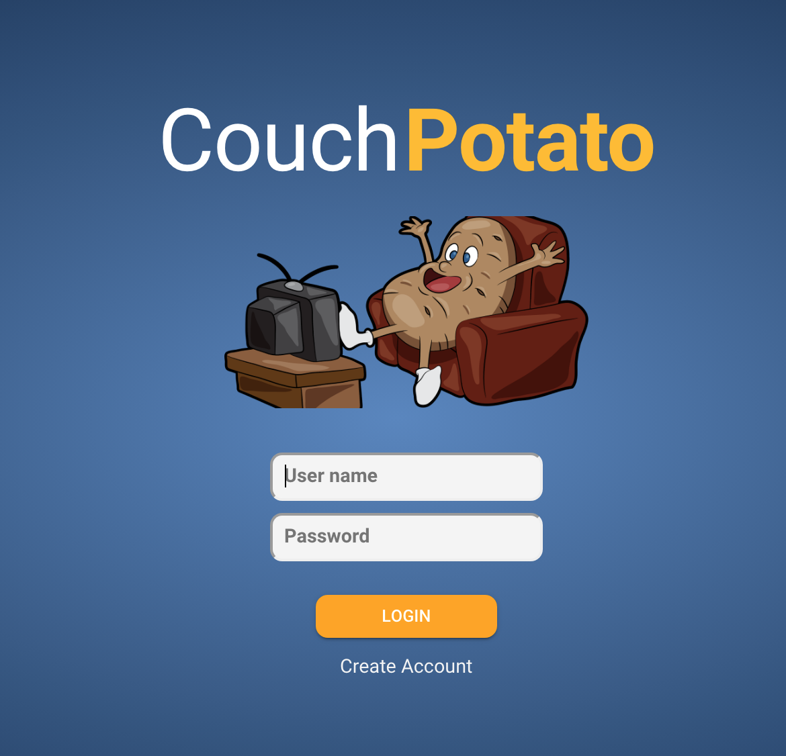

# Home Page

The home page will be the first page to load and from where the user will be able to login or create an account.

**Inputs**

| Name | Max Length | Placeholder Text |
| :--- | :--- | :--- |
| User Name | 24 | User name |
| Password | 40 | Password |

**Actions**

| Caption | Type | Action |
| :--- | :--- | :--- |
| LOGIN | Button | Validate user name and password and then open the [Dashboard](./#3-dashboard) |
| Create Account | Text | Open the [create account](./#2-create-account) screen |

**Validation**

| **Exception** | Error Message |
| :--- | :--- |
| No user name | Username not entered |
| No password | Password not entered |
| Password or user name is invalid | Invalid username or password |

**Assets**

couch-potato-main.png

